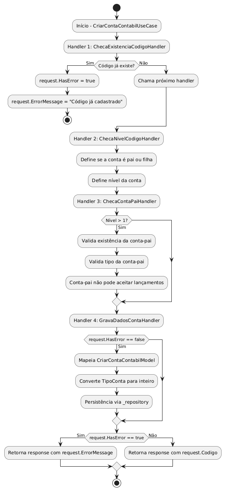
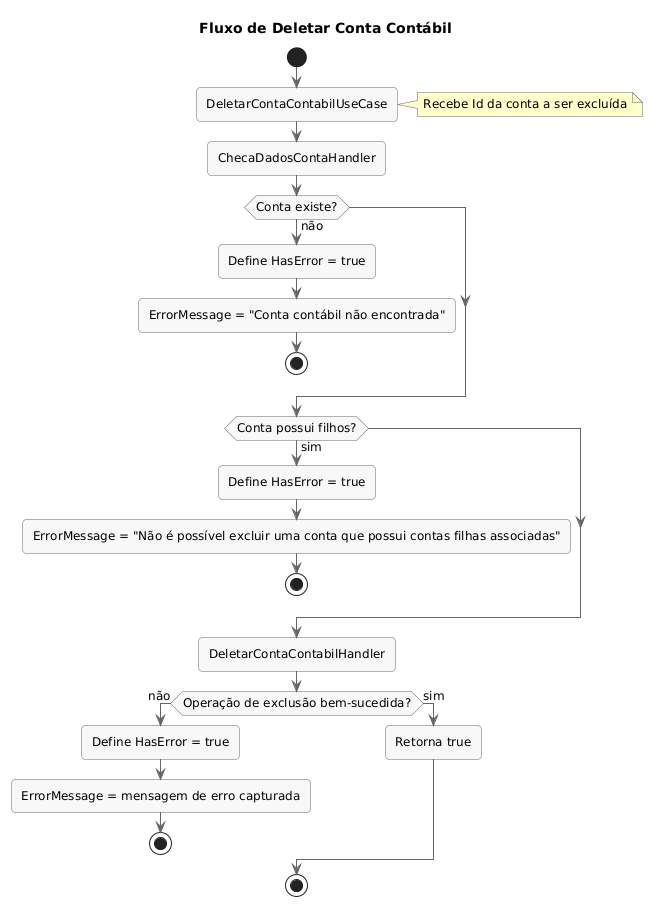
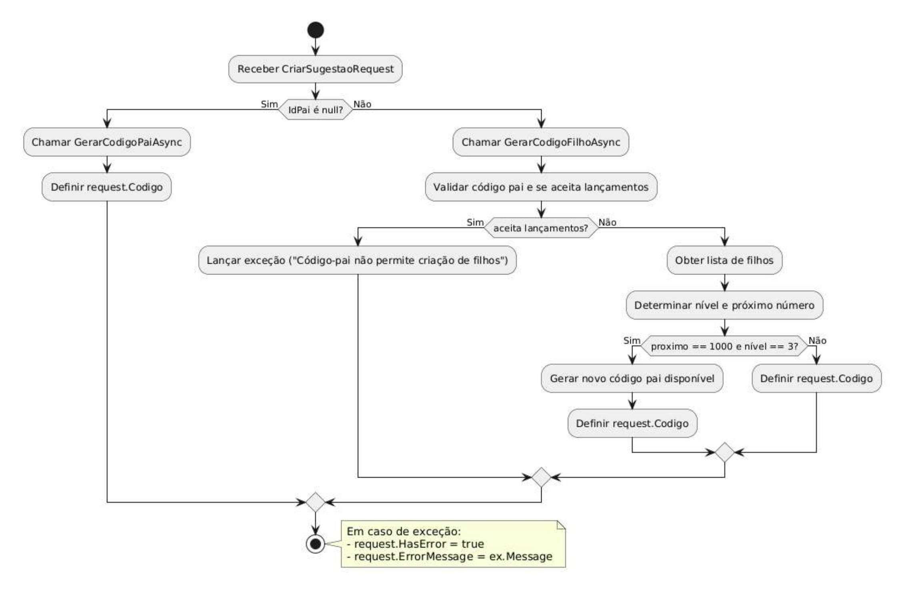

# API de Contabilidade 
## Sistema de Gestão de Contas Contábeis

Este repositório implementa o fluxo de **criação de contas contábeis** utilizando **.NET 8**, seguindo os princípios de **Clean Architecture**, **Clean Code** e o padrão de projeto **Chain of Responsibility**.

### 📋 Sumário

- [Visão Geral](#visão-geral)
- [Etapas de instalação](#etapas-de-instalação)
- [Tecnologias](#-tecnologias-utilizadas)
- [Padrão Chain of Responsibility](#-padrão-chain-of-responsibility)
- [Fluxos Principais](#-fluxos-principais)
  - [Criação de Conta Contábil](#-fluxo-de-criação-de-conta-contábil)
  - [Edição de Conta Contábil](#-fluxo-de-edição-de-conta-contábil)
  - [Deleção de Conta Contábil](#-fluxo-de-deleção-de-conta-contábil)
  - [Geração de Sugestão de Código](#-fluxo-de-geração-de-sugestão-de-código)
- [Arquitetura](#-arquitetura)
- [Licença](#-licença)
- [Contribuição](#-contribuição)

### 🔍 Visão Geral

Este projeto implementa uma API completa para gestão de contas contábeis, permitindo a criação e edição de contas hierárquicas (pais e filhas), com validações robustas de regras de negócio e geração automática de sugestões de códigos contábeis.

### 🚀 Etapas de instalação

Este projeto foi desenvolvido como uma aplicação conteinerizada utilizando Docker Compose, facilitando sua instalação e execução em qualquer ambiente compatível.

### 🛠 Recursos disponibilizados

O ambiente de execução inclui os seguintes recursos:

- **WebApi**: API principal de contabilidade em .NET 8
- **SQL Server**: Banco de dados relacional para persistência dos dados
- **ElasticSearch**: Motor de busca e análise distribuído
- **Kibana**: Interface de usuário para visualização de dados do ElasticSearch
- **Portainer**: Interface web para gerenciamento de containers Docker
- **HealthCheck**: Mecanismo de monitorização da saúde da aplicação e dos serviços dependentes. 

### 📋 Pré-requisitos

Antes de começar, você vai precisar ter instalado as seguintes ferramentas:
- [Git](https://git-scm.com)
- [Docker](https://www.docker.com/products/docker-desktop)

Além disto, sugiro que você também utilize um bom editor de código, como o [VSCode](https://code.visualstudio.com/). Este vai te oferecer muitas extensões que farão toda diferença.

### 🔧 Dependências do projeto

Abra seu terminal na pasta da solução e execute o seguinte comando:
```bash
$ dotnet restore
```

### ⚙️ Executando o projeto

Agora que você já tem tudo... chegou a hora de testar. Novamente, abra seu terminal na pasta raiz da solução, digite o comando abaixo e aguarde o fim do processo ☕

```bash
$ docker-compose up -d 
```

O Docker vai baixar do seu repositório https://hub.docker.com todas as imagens mencionadas no arquivo do compose (yaml). Depois, inicia a geração da imagem e por fim a geração do container. Em poucos instantes nosso container estará de pé.

Quando esse processo encerrar, você pode conferir usando o comando abaixo:
```bash
$ docker-compose ps  
```

Atente para os seguintes containers:
- **webapi-1**: API de Contabilidade
- **sqlserver**: Banco de dados SQL Server
- **portainer**: Interface de gerenciamento de containers
- **elasticsearch**: Motor de busca e análise
- **kibana**: Interface para o ElasticSearch

### 🛠 Tecnologias Utilizadas

- **.NET 8.0**
- **MediatR**
- **FluentValidation**
- **Dapper**
- **Entity Framework** (somente para migrations)
- **SQL Server**
- **Clean Architecture** e **Clean Code**
- **Design Pattern** (Chain of Responsability)
- **HealthChecks**
- **Serilog**
- **ElasticSearch**
- **Kibana**
- **Versionamento de APIs**
- **xUnit** (para testes unitários)

### 🔗 Padrão Chain of Responsibility

### Conceito
O **Chain of Responsibility** é um padrão comportamental que permite passar solicitações ao longo de uma cadeia de handlers. Cada handler decide se processa a solicitação ou a passa para o próximo handler na cadeia.


### Implementação no Projeto

A aplicação utiliza o padrão Chain of Responsibility para processar as requisições de criação, edição e sugestão de contas contábeis. Cada handler na cadeia é responsável por uma validação ou processamento específico.

#### Classe Base de Handler
```csharp
public abstract class Handler<T>
{
    protected Handler<T>? _next;

    public void SetNext(Handler<T> next)
    {
        _next = next;
    }

    public abstract Task Process(T request);
}
```

#### Encadeamento de Handlers
```csharp
// Exemplo do fluxo de criação
var h1 = new ChecaExistenciaCodigoHandler(_repository);
var h2 = new ChecaNivelCodigoHandler();
var h3 = new ChecaContaPaiHandler(_repository);
var h4 = new GravaDadosContaHandler(_repository);

h1.SetNext(h2);
h2.SetNext(h3);
h3.SetNext(h4);

await h1.Process(request);
```

#### Exemplo de Handler Concreto
```csharp
public class ChecaExistenciaCodigoHandler : Handler<CriarContaContabilRequest>
{
    private readonly IContaContabilRepository _repository;

    public ChecaExistenciaCodigoHandler(IContaContabilRepository repository)
    {
        _repository = repository;
    }

    public override async Task Process(CriarContaContabilRequest request)
    {
        var existeCodigo = await _repository.ExisteCodigoCadastrado(request.Codigo);

        if (existeCodigo)
        {
            request.HasError = true;
            request.ErrorMessage = "Código já cadastrado";
            return;
        }

        if (_next != null)
            await _next.Process(request);
    }
}
```

### Benefícios do Padrão no Projeto

1. **Desacoplamento**: Cada handler conhece apenas sua responsabilidade específica.
2. **Manutenibilidade**: Facilita adicionar, remover ou modificar validações sem afetar o restante do código.
3. **Testabilidade**: Permite testar cada handler isoladamente.
4. **Flexibilidade**: Os handlers podem ser reordenados ou reutilizados em diferentes fluxos.
5. **Princípio da Responsabilidade Única**: Cada handler faz apenas uma coisa.
6. **Legibilidade**: O fluxo de processamento é claro e explícito.

### Uso nos Fluxos Principais

O padrão é utilizado nos três fluxos principais do sistema:

1. **Criação de Conta Contábil**: Validações sequenciais de código, nível, conta-pai e persistência.
2. **Edição de Conta Contábil**: Validações sequenciais de nível, existência, consistência e atualização.
3. **Exclusão de Conta Contábil**: Validações sequenciais para verificar existência da conta e ausência de contas filhas antes da exclusão definitiva.
4. **Geração de Sugestão**: Embora use apenas um handler, mantém a mesma estrutura para consistência.

### 🔁 Fluxo de Criação de Conta Contábil

O processo de criação é iniciado por meio do `UseCase` `CriarContaContabilUseCase`, que é invocado pelo **MediatR**. A requisição (`CriarContaContabilRequest`) percorre uma cadeia de handlers responsáveis por realizar validações e, por fim, persistir os dados no repositório.

### 📑 Etapas do Fluxo

#### 1. Início do Processo – `CriarContaContabilUseCase`
- O método `Handle` recebe o request.
- São instanciados e encadeados os seguintes handlers:
  - `ChecaExistenciaCodigoHandler`
  - `ChecaNivelCodigoHandler`
  - `ChecaContaPaiHandler`
  - `GravaDadosContaHandler`
- O fluxo se inicia com:  
  `await h1.Process(request);`

---

### 🧩 Handlers (Chain of Responsibility)

#### 🔹 `ChecaExistenciaCodigoHandler`
- Verifica se o código informado já está cadastrado.
- Se existir, define:
  ```csharp
  request.HasError = true;
  request.ErrorMessage = "Código já cadastrado";
  ```
- Caso contrário, chama o próximo handler.

---

#### 🔹 `ChecaNivelCodigoHandler`
- Define se a conta é pai ou filha com base no `IdPai`.

**Conta pai:**
- `IdPai` é `null` ou `Guid.Empty`.
- Código **não pode conter ponto** (`"."`).
- Não pode aceitar lançamentos.
- Nível definido como 1.

**Conta filha:**
- Código contém subníveis (`"."`).
- Nível calculado com `Count('.') + 1`.

---

#### 🔹 `ChecaContaPaiHandler`
- Executado apenas se o nível da conta for **maior que 1**.
- Calcula o código da conta-pai com base no nível.
- Validações:
  - Verifica se a conta-pai existe.
  - Verifica se o **tipo** da conta é igual ao da conta-pai.
  - A conta-pai **não pode aceitar lançamentos**.

---

#### 🔹 `GravaDadosContaHandler`
- Só executa se `request.HasError == false`.
- Mapeia `CriarContaContabilModel` com os dados recebidos.
- Converte o tipo de conta (`TipoConta`) para inteiro:
  - 1 = Receitas
  - 2 = Despesas
- Chama `_repository.CriarContaContabil(...)` para persistência.

---

### 📤 Retorno Final

Ao fim do processo, o `CriarContaContabilUseCase` retorna uma resposta:

```csharp
return new CriarContaContabilResponse
{
    Data = request.HasError
        ? request.ErrorMessage
        : request.Codigo
};
```

---

### 🔍 Diagrama de Fluxo



---

### 📂 Estrutura Envolvida

```
Application
│
├── UseCases
│   └── ContaContabil
│       └── Create
│           ├── CriarContaContabilUseCase.cs
│           ├── CriarContaContabilRequest.cs
│           ├── CriarContaContabilResponse.cs
│           └── Handlers
│               ├── ChecaExistenciaCodigoHandler.cs
│               ├── ChecaNivelCodigoHandler.cs
│               ├── ChecaContaPaiHandler.cs
│               └── GravaDadosContaHandler.cs
```
---

### 🔁 Fluxo de Edição de Conta Contábil

O processo de edição é iniciado por meio do `UseCase` `EditarContaContabilUseCase`, que é invocado pelo **MediatR**. A requisição (`EditarContaContabilRequest`) percorre uma cadeia de handlers responsáveis por realizar validações e, se não houver erros, atualiza os dados no repositório.

### 📑 Etapas do Fluxo

#### 1. Início do Processo – `EditarContaContabilUseCase`
- O método `Handle` recebe o request.
- São instanciados e encadeados os seguintes handlers:
  - `ChecaNivelCodigoHandler`
  - `ChecaExistenciaCodigoHandler`
  - `ChecaConsistenciaCodigoHandler`
  - `GravarDadosContaHandler`
- O fluxo se inicia com:  
  `await h1.Process(request);`

---

### 🧩 Handlers (Chain of Responsibility)

#### 🔹 `ChecaNivelCodigoHandler`
- Calcula o nível da conta com base na estrutura do código.
- Se o código **não contém ponto (`"."`)**, define o nível como `1`.
- Se contém ponto, define o nível com base na quantidade de subníveis: `Count('.') + 1`.
- Exemplo: `"1.1.1"` ⇒ Nível `3`.

---

#### 🔹 `ChecaExistenciaCodigoHandler`
- Verifica se o código informado existe no banco de dados.
- Se **não existir**, define:
  ```csharp
  request.HasError = true;
  request.ErrorMessage = "Codigo não encontrado";
  ```
- Caso contrário, chama o próximo handler.

---

#### 🔹 `ChecaConsistenciaCodigoHandler`
- Executado apenas se o nível da conta for **1**, **2** ou **3**.
- Validações:
  - Se houver **filhos cadastrados**, **o tipo da conta não pode ser alterado**.
  - Se o nível for `2`, valida se o **tipo da conta é igual ao da conta-pai**.
- Também define o `Id` da conta para persistência posterior.

---

#### 🔹 `GravarDadosContaHandler`
- Só executa se `request.HasError == false`.
- Mapeia `EditarContaContabilModel` com os dados atualizados.
- Converte o tipo da conta (`TipoConta`) para inteiro:
  - 1 = Receitas
  - 2 = Despesas
- Converte o campo booleano `AceitaLancementos` para inteiro (0 ou 1).
- Chama `_repository.EditarContaContabil(...)` para atualização no banco.

---

### 📤 Retorno Final

Ao fim do processo, o `EditarContaContabilUseCase` retorna uma resposta:

```csharp
return new EditarContaContabilResponse
{
    Data = request.HasError
        ? request.ErrorMessage
        : true
};
```

---

### 🔍 Diagrama de Fluxo


---

### 📂 Estrutura Envolvida

```
Application
│
├── UseCases
│   └── ContaContabil
│       └── Update
│           ├── EditarContaContabilUseCase.cs
│           ├── EditarContaContabilRequest.cs
│           ├── EditarContaContabilResponse.cs
│           └── Handlers
│               ├── ChecaNivelCodigoHandler.cs
│               ├── ChecaExistenciaCodigoHandler.cs
│               ├── ChecaConsistenciaCodigoHandler.cs
│               └── GravarDadosContaHandler.cs
```

---

### 🔁 Fluxo de Deleção de Conta Contábil

O processo de exclusão de contas contábeis é iniciado por meio do `UseCase` `DeletarContaContabilUseCase`, que é invocado pelo **MediatR**. A requisição (`DeletarContaContabilRequest`) percorre uma cadeia de handlers responsáveis por realizar validações e, se não houver erros, remove a conta do repositório.

### 📑 Etapas do Fluxo

#### 1. Início do Processo – `DeletarContaContabilUseCase`
- O método `Handle` recebe o request contendo o `Id` da conta a ser excluída.
- São instanciados e encadeados os seguintes handlers:
  - `ChecaDadosContaHandler`
  - `DeletarContaContabilHandler`
- O fluxo se inicia com:  
  `await h1.Process(request);`

---

### 🧩 Handlers (Chain of Responsibility)

#### 🔹 `ChecaDadosContaHandler`
- Verifica se a conta com o `Id` fornecido existe no banco de dados.
- Se **não existir**, lança uma exceção `NotFoundException`:
  ```csharp
  throw new NotFoundException("Conta contábil não encontrada");
  ```
- Verifica se a conta possui contas filhas associadas.
- Se **tiver filhos**, não permite a exclusão:
  ```csharp
  throw new Exception("Não é possível excluir uma conta que possui contas filhas associadas");
  ```
- Em caso de qualquer exceção, define:
  ```csharp
  request.HasError = true;
  request.ErrorMessage = ex.Message;
  ```
- Após as verificações, passa para o próximo handler.

---

#### 🔹 `DeletarContaContabilHandler`
- Só executa se `request.HasError == false`.
- Chama `_repository.DeletarContaContabil(request.Id)` para remover a conta do banco de dados.
- Em caso de exceção durante a exclusão, define:
  ```csharp
  request.HasError = true;
  request.ErrorMessage = ex.Message;
  ```

---

### 📤 Retorno Final

Ao fim do processo, o `DeletarContaContabilUseCase` retorna uma resposta:

```csharp
return new DeletarContaContabilResponse
{
    Data = request.HasError
        ? request.ErrorMessage
        : true
};
```

---

### 🔍 Diagrama de Fluxo



---

### 📂 Estrutura Envolvida

```
Application
│
├── UseCases
│   └── ContaContabil
│       └── Delete
│           ├── DeletarContaContabilUseCase.cs
│           ├── DeletarContaContabilRequest.cs
│           ├── DeletarContaContabilResponse.cs
│           └── Handlers
│               ├── ChecaDadosContaHandler.cs
│               └── DeletarContaContabilHandler.cs
```

---

### 🧪 Validações
- A conta contábil deve existir para ser excluída
- A conta não pode ter contas filhas associadas
- Se qualquer uma dessas condições falhar, a operação é abortada

### ⚡️ Exemplo de Retorno

Em caso de sucesso:
```json
{
  "Data": true
}
```

Em caso de erro:
```json
{
  "Data": "Não é possível excluir uma conta que possui contas filhas associadas"
}
```

ou

```json
{
  "Data": "Conta contábil não encontrada"
}
```

---

### 🔁 Fluxo de geração de sugestão

### 🏁 Início do processo (CriarSugestaoUseCase)
O processo se inicia com a chamada ao `CriarSugestaoUseCase`, um handler do MediatR que recebe um `CriarSugestaoRequest`.

- Instancia o `GerarSugestaoHandler`
- Chama `await h1.Process(request)`

Ao final, retorna um `CriarSugestaoResponse` com o código sugerido ou uma mensagem de erro.

### 🧩 Handler: GerarSugestaoHandler

Este handler contém toda a lógica de sugestão de código contábil.

#### 🔹 request.IdPai é nulo?
- Se sim: chama `GerarCodigoPaiAsync()`
  - Gera o próximo código disponível de nível 1 (ex: `1`, `2`, ...)
- Se não: chama `GerarCodigoFilhoAsync(request.IdPai)`
  - Valida existência da conta-pai
  - Verifica se a conta-pai permite criação de filhos
  - Busca os filhos existentes
  - Calcula o próximo código com base na estrutura hierárquica (ex: `1.1`, `1.2.3`)

#### 🔹 Lógica para contas-filhas
- Determina o nível baseado nos pontos (`.`) do código
- Busca o maior valor numérico da última parte dos filhos existentes
- Gera o próximo valor incremental (ex: se filhos são `1.2.1`, `1.2.2`, o próximo será `1.2.3`)
- Se houver limitação (ex: `1.2.999`), busca o próximo código-pai disponível

---

### 🔍 Diagrama de Fluxo



### 🧪 Validações
- Código-pai deve existir
- Código-pai não pode aceitar lançamentos
- Se nível máximo atingido, cria novo código-pai usando `EncontrarProximoCodigoPaiDisponivelAsync()`

### 📤 Retorno Final
- `request.Codigo` recebe o código sugerido, caso sucesso
- Em caso de falha, `request.HasError = true` e `request.ErrorMessage` é preenchido

### ⚡️ Exemplo de Retorno

```json
{
  "Data": "1.3.2"
}
```

ou

```json
{
  "Data": "Código-pai não encontrado"
}
```

---

### 🏗 Arquitetura

O projeto segue os princípios da Clean Architecture:

```
├── API
│   └── Controllers
│       └── ContaContabilController.cs
├── Application
│   ├── Common
│   │   └── Handler.cs
│   └── UseCases
│       └── ContaContabil
│           ├── Create
│           ├── Update
│           └── Suggestion
├── Domain
│   └── Entities
│       └── ContaContabil.cs
└── Infrastructure
    ├── Data
    │   └── Repositories
    │       └── ContaContabilRepository.cs
    └── Extensions
        └── ServiceCollectionExtensions.cs
```
### 📄 Licença

Este projeto está licenciado sob os termos da licença MIT.

---

### 🤝 Contribuição

Contribuições são bem-vindas! Sinta-se à vontade para abrir issues ou pull requests.

---
